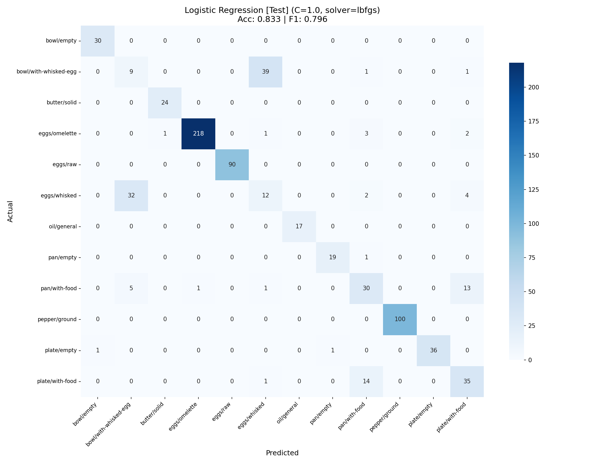
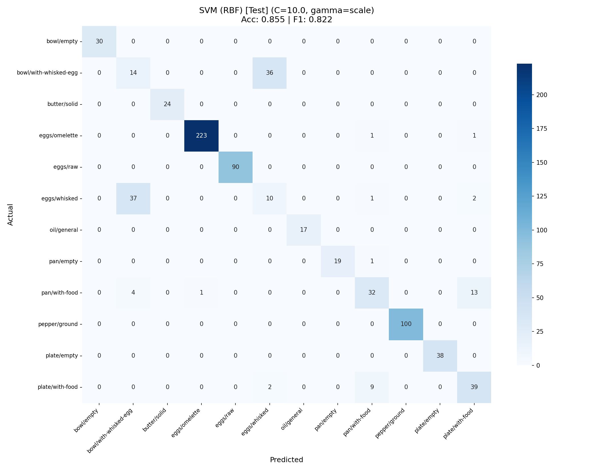
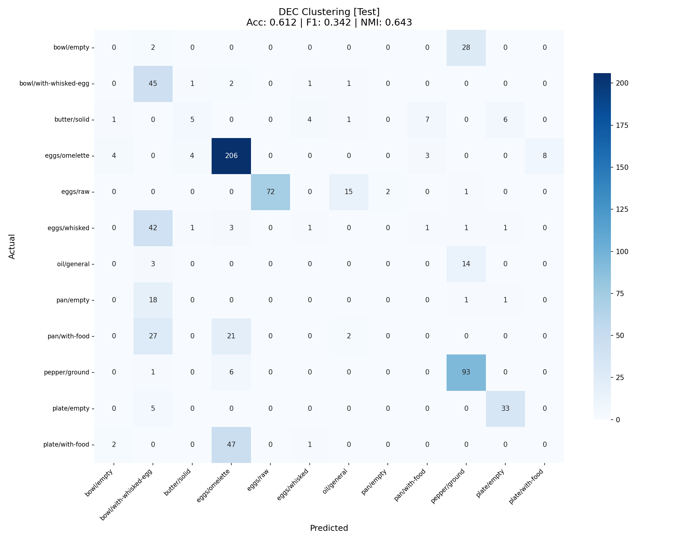
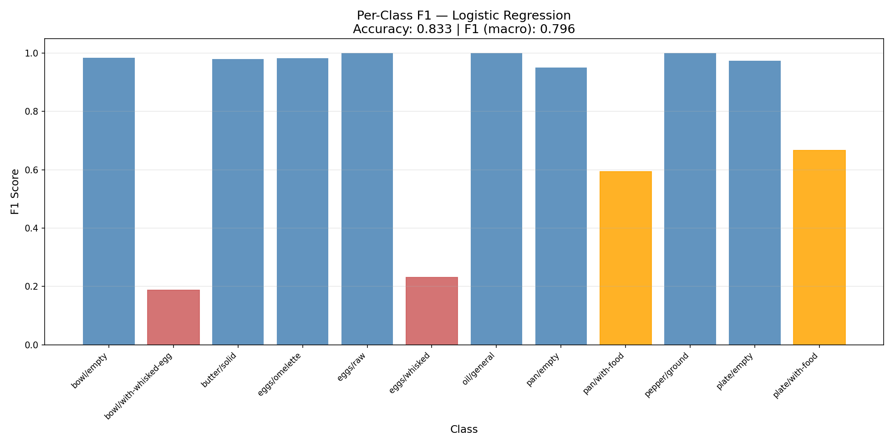
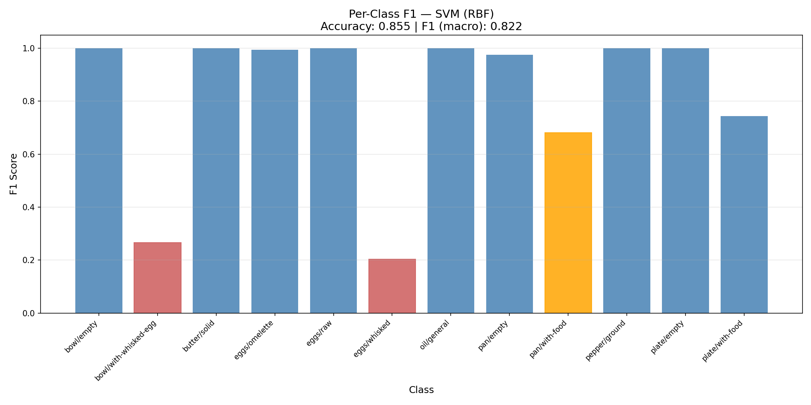
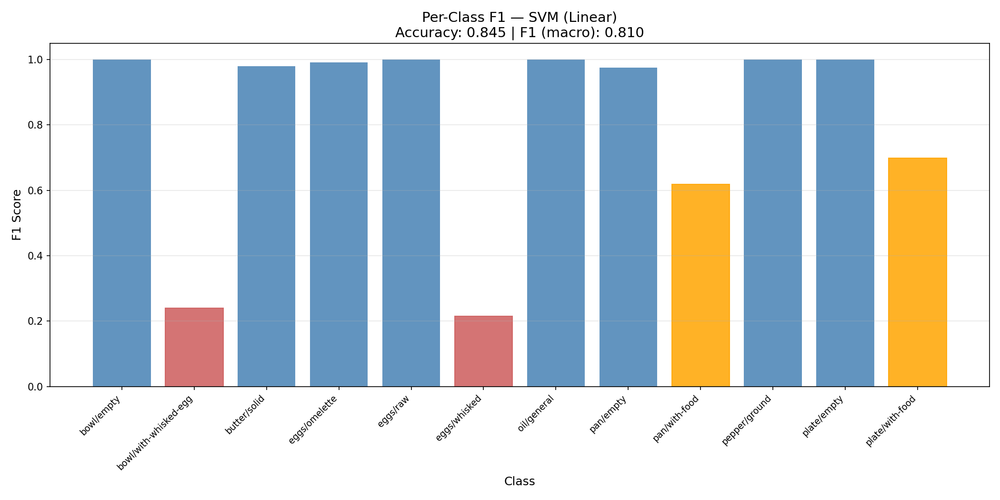
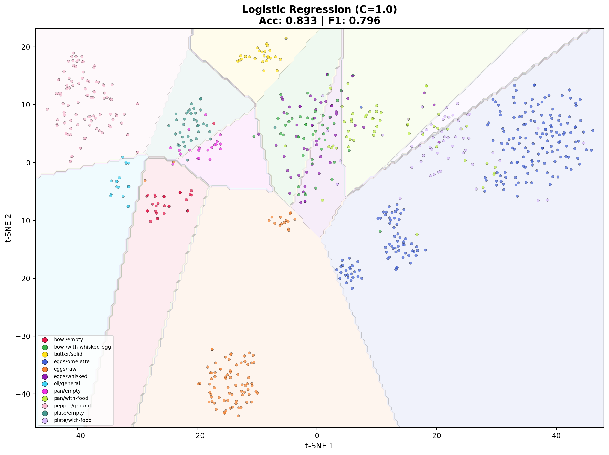
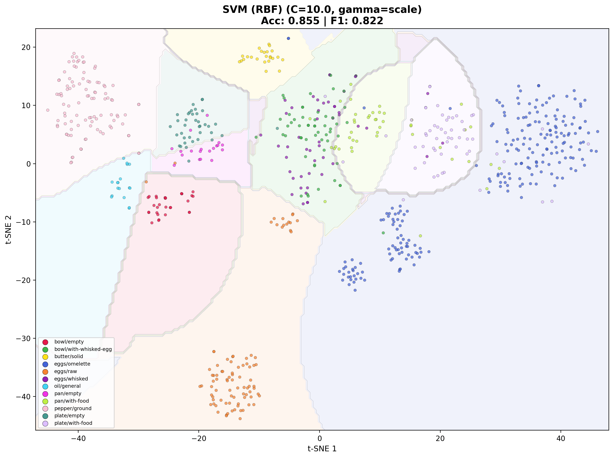
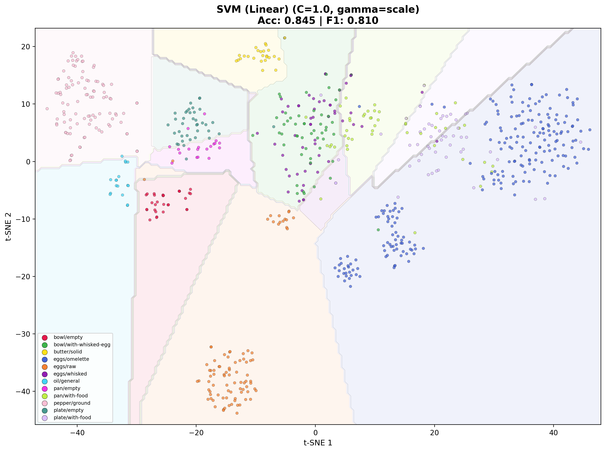
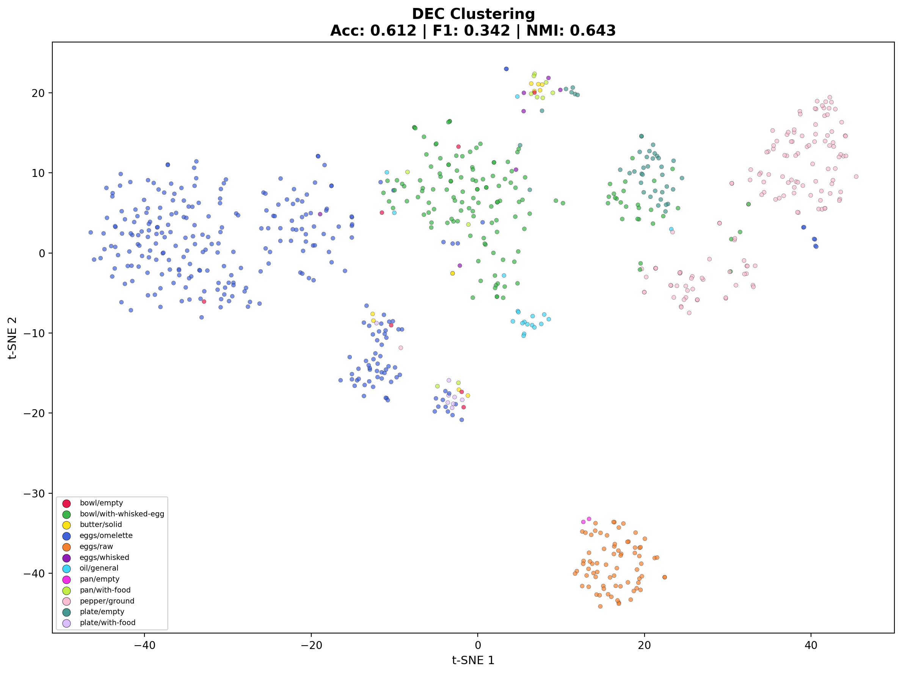

# TVS-ChaD — <u>T</u>emporal <u>V</u>ideo <u>S</u>tate <u>Cha</u>nge <u>D</u>etection

A video understanding system that tracks object state changes during cooking tasks and logs them into a structured "memory bank." The pipeline processes cooking videos, detects when objects (eggs, pans, bowls, etc.) transition between states (raw → whisked → omelette), and documents each change with timestamps, confidence scores, and frame references.

Two approaches are implemented and compared:

- **Part 1 (Zero-Shot VLM):** Uses vision-language models for zero-shot state tracking — no training data required.
- **Part 2 (Classical Models):** Uses CLIP embeddings with supervised classifiers (LogReg, SVM) and unsupervised deep clustering (DEC) trained on curated datasets.

---

## Table of Contents

- [Project Structure](#project-structure)
- [Part 1 — Zero-Shot VLM Video State Tracker](#part-1--zero-shot-vlm-video-state-tracker)
- [Part 2 — Classical Models: Classification & Clustering](#part-2--classical-models-classification--clustering)
  - [Setup & Installation](#setup--installation)
  - [Dataset Preparation](#dataset-preparation)
  - [Pipeline Execution](#pipeline-execution)
  - [Video Inference](#video-inference)
  - [Results](#results)

---

## Project Structure

```
root/
├── classical-models/                  # Part 2 — Classification & Clustering
│   ├── .env                           # API keys (PEXELS_API_KEY)
│   ├── .gitignore
│   ├── requirements.txt               # Python dependencies
│   ├── datasets-links.txt             # Dataset source URLs
│   │
│   ├── config/                        # Configuration files
│   │
│   ├── data/
│   │   ├── raw/                       # Raw scraped/downloaded images
│   │   │   ├── bowl/
│   │   │   │   ├── empty/
│   │   │   │   └── with-whisked-egg/
│   │   │   ├── butter/
│   │   │   │   └── solid/
│   │   │   ├── eggs/
│   │   │   │   ├── omelette/
│   │   │   │   ├── raw/
│   │   │   │   └── whisked/
│   │   │   ├── oil/
│   │   │   ├── pan/
│   │   │   │   ├── empty/
│   │   │   │   └── with-food/
│   │   │   ├── pepper/
│   │   │   │   └── black pepper/
│   │   │   ├── plate/
│   │   │   │   ├── empty/
│   │   │   │   └── with-food/
│   │   │   └── utensils/              # Kitchenware dataset (pan/plate source)
│   │   │
│   │   ├── organized/                 # Cleaned train/test/val splits
│   │   │   └── <object>/<state>/(train|test|val)/
│   │   │
│   │   └── embeddings/                # Cached CLIP embeddings
│   │       └── clip_vit_b32/
│   │
│   ├── scripts/
│   │   ├── scrape_pexels.py           # Scrape images from Pexels API
│   │   ├── sort_utensils.py           # Extract pan/plate from kitchenware dataset
│   │   ├── organize_data.py           # Unify raw data → organized splits
│   │   ├── extract_embeddings.py      # CLIP ViT-B/32 feature extraction
│   │   ├── classify_logreg.py         # Logistic Regression classifier
│   │   ├── classify_svm.py            # SVM (Linear + RBF) classifier
│   │   ├── classify_deep_cluster.py   # Deep Embedded Clustering (DEC)
│   │   ├── video_inference.py         # Run all models on a cooking video
│   │   └── utils.py                   # Shared utilities
│   │
│   ├── models/                        # Saved trained models
│   │   ├── logreg_model.pkl
│   │   ├── svm_linear_model.pkl
│   │   ├── svm_rbf_model.pkl
│   │   └── dec_model.pt
│   │
│   ├── outputs/                       # All results, plots, memory banks
│   │   ├── logreg_<timestamp>/
│   │   ├── svm_<timestamp>/
│   │   ├── dec_<timestamp>/
│   │   └── video_inference_<timestamp>/
│   │
│   │
│   └── videos/                        # Input cooking videos
│
├── Zero_Shot_VLM/                     # Part 1 — Zero-shot VLM pipeline
│   ├── main.py                        # Entry point
│   ├── config.py                      # Model and API configuration
│   ├── schema_generator.py            # Generates state schemas from task descriptions
│   ├── requirements.txt               # Part 1 dependencies
│   ├── core/                          # Core tracking and inference logic
│   ├── utils/                         # Helper utilities
│   ├── backends/                      # Model backend integrations
│   ├── input/                         # Sample input videos
│   └── output/                        # Generated results
│
└── README.md                          # This file
```

---

## Part 1 — Zero-Shot VLM Video State Tracker

A zero-shot video understanding system that tracks object/activity states using vision-language models. Given a video and a natural language task description, it identifies and tracks relevant state changes across frames — no task-specific training required.

### Setup

```bash
cd Zero_Shot_VLM
pip install -r requirements.txt
```

Update `config.py` with any required API keys or model paths before running.

### Usage

```bash
python main.py --video input/test_h264.webm --task "making an omelette from scratch" --threshold 0.70
```

**Arguments:**

| Argument      | Description                                               |
| ------------- | --------------------------------------------------------- |
| `--video`     | Path to the input video file                              |
| `--task`      | Natural language description of the activity to track     |
| `--threshold` | Confidence threshold for state change detection (0.0–1.0) |

Results are saved to the `output/` directory.

### Examples

```bash
# Track state changes while making an omelette
python main.py --video input/test_h264.webm --task "making an omelette from scratch" --threshold 0.70

# Lower threshold for more sensitive detection
python main.py --video input/test_h264.webm --task "making an omelette from scratch" --threshold 0.50
```

---

## Part 2 — Classical Models: Classification & Clustering

This section covers the classification and clustering component. Given CLIP embeddings of cooking frames, we classify the state of objects using three approaches — **Logistic Regression**, **SVM (Linear + RBF)**, and **Deep Embedded Clustering (DEC)** — and benchmark their performance.

### Setup & Installation

#### 1. Create Virtual Environment

```bash
cd classical-models
python -m venv .venv
.venv\Scripts\activate        # Windows
# source .venv/bin/activate   # Linux/Mac
```

#### 2. Install PyTorch with GPU Support

```bash
# CUDA 13.0
pip install torch torchvision --index-url https://download.pytorch.org/whl/cu130

# CUDA 12.8
pip install torch torchvision --index-url https://download.pytorch.org/whl/cu128

# CUDA 12.6
pip install torch torchvision --index-url https://download.pytorch.org/whl/cu126
```

> Check your CUDA version with `nvidia-smi` (top right corner).

#### 3. Install Remaining Dependencies

```bash
pip install -r requirements.txt
```

#### 4. Configure API Keys

Create a `.env` file in the project root:

```
PEXELS_API_KEY=your-pexels-api-key-here
```

Get a free Pexels API key at: https://www.pexels.com/api/ (200 requests/hour, 20,000/month)

---

### Dataset Preparation

The dataset spans **12 classes** across **7 objects** with a total of **9,843 images**.

#### Classes & Dataset Size

| Object    | State            |     Train |    Test |     Val |     Total | Source                   |
| --------- | ---------------- | --------: | ------: | ------: | --------: | ------------------------ |
| Bowl      | empty            |       440 |      30 |      30 |       500 | Roboflow                 |
| Bowl      | with-whisked-egg |       400 |      50 |      50 |       500 | Pexels (scraped)         |
| Butter    | solid            |       519 |      24 |      52 |       595 | Roboflow                 |
| Eggs      | omelette         |     1,300 |     225 |     225 |     1,750 | Roboflow + Food-101      |
| Eggs      | raw              |     1,674 |      90 |     164 |     1,928 | Roboflow + Kaggle        |
| Eggs      | whisked          |       400 |      50 |      50 |       500 | Pexels (scraped)         |
| Oil       | general          |       924 |      17 |      38 |       979 | Roboflow                 |
| Pan       | empty            |       165 |      20 |      22 |       207 | Roboflow (kitchenware)   |
| Pan       | with-food        |       400 |      50 |      50 |       500 | Pexels (scraped)         |
| Pepper    | ground           |       800 |     100 |     100 |     1,000 | Mendeley (SpiceSpectrum) |
| Plate     | empty            |       307 |      38 |      39 |       384 | Roboflow (kitchenware)   |
| Plate     | with-food        |       400 |      50 |      50 |       500 | Pexels (scraped)         |
| **Total** |                  | **7,729** | **794** | **870** | **9,843** |                          |

Split ratio: **~80% train / ~10% test / ~10% val**

#### Step 1 — Download Datasets

Download the following datasets and place them in `data/raw/` as indicated. For Roboflow datasets, download in **Multi-Label Classification** format.

**Eggs / Raw**

| Source                       | Link                                                                                        |
| ---------------------------- | ------------------------------------------------------------------------------------------- |
| Roboflow (egg-egg)           | https://universe.roboflow.com/new-workspace-ltyar/egg-egg-1hseh                             |
| Kaggle (Eggs Classification) | https://www.kaggle.com/datasets/abdullahkhanuet22/eggs-images-classification-damaged-or-not |

→ Place in `data/raw/eggs/raw/`

**Eggs / Omelette**

| Source                  | Link                                                   |
| ----------------------- | ------------------------------------------------------ |
| Roboflow (egg-nr8a6)    | https://universe.roboflow.com/bully/egg-nr8a6          |
| Roboflow (omelet-acsyh) | https://universe.roboflow.com/mjeed-ybg6c/omelet-acsyh |
| Kaggle (Food-101)       | https://www.kaggle.com/datasets/dansbecker/food-101    |

→ Place in `data/raw/eggs/omelette/` (for Food-101, extract the `omelette` folder from `images/`)

**Eggs / Whisked** — _No dedicated dataset. Collected via Pexels API (Step 2)._

**Butter / Solid**

| Source                    | Link                                                       |
| ------------------------- | ---------------------------------------------------------- |
| Roboflow (butterdetector) | https://universe.roboflow.com/passthebutter/butterdetector |

→ Place in `data/raw/butter/solid/`

**Oil**

| Source                      | Link                                                    |
| --------------------------- | ------------------------------------------------------- |
| Roboflow (palm-cooking-oil) | https://universe.roboflow.com/ai-x2dqi/palm-cooking-oil |

→ Place in `data/raw/oil/`

**Pepper (Ground Black Pepper)**

| Source                   | Link                                            |
| ------------------------ | ----------------------------------------------- |
| Mendeley (SpiceSpectrum) | https://data.mendeley.com/datasets/5v7w2hx8n5/2 |

→ Place in `data/raw/pepper/black pepper/`

**Pan / Empty & Plate / Empty** (from same kitchenware dataset)

| Source                      | Link                                                                        |
| --------------------------- | --------------------------------------------------------------------------- |
| Roboflow (kitchen-utensils) | https://universe.roboflow.com/kitchen-utensils-9yv2y/kitchen-utensils-3ypt0 |

→ Download and place in `data/raw/utensils/` with train/test/val splits intact, then run:

```bash
python scripts/sort_utensils.py
```

This reads the `_classes.csv` files and copies frying pan → `data/raw/pan/empty/` and plate → `data/raw/plate/empty/`.

**Bowl / Empty**

| Source                 | Link                                                                   |
| ---------------------- | ---------------------------------------------------------------------- |
| Roboflow (steel bowls) | https://universe.roboflow.com/yolov8-a3acc/steel-bowls-detection-ilowl |
| Roboflow (bowl-cis7f)  | https://universe.roboflow.com/practicas-djpmv/bowl-cis7f               |

→ Place in `data/raw/bowl/empty/`

**Pan / With Food, Plate / With Food, Bowl / With Whisked Egg** — _No dedicated datasets. Collected via Pexels API (Step 2)._

#### Step 2 — Scrape Missing Classes from Pexels

Five classes are collected via the Pexels API: eggs/whisked, pan/with-food, plate/with-food, bowl/with-whisked-egg.

```bash
python scripts/scrape_pexels.py
```

Scrapes ~500 images per class using diverse search queries, deduplicates by content hash, and resizes to 512×512.

> **Important:** Scraped images require manual curation. Review each folder and delete irrelevant images before proceeding.

#### Step 3 — Organize into Train/Test/Val

```bash
python scripts/organize_data.py
```

Unifies all raw data (various formats — loose images, pre-split folders with CSVs, nested paths) into:

```
data/organized/<object>/<state>/(train|test|val)/
```

---

### Pipeline Execution

Run the scripts in this order:

#### Step 1 — Extract CLIP Embeddings

```bash
python scripts/extract_embeddings.py
```

Extracts 512-dimensional CLIP ViT-B/32 embeddings for every image in each split. Cached to `data/embeddings/clip_vit_b32/` — only needs to run once. Uses GPU if available.

#### Step 2 — Train & Evaluate Classifiers

```bash
# Logistic Regression
python scripts/classify_logreg.py

# SVM (Linear + RBF)
python scripts/classify_svm.py

# Deep Embedded Clustering
python scripts/classify_deep_cluster.py
```

Each script:

- Loads cached embeddings
- Trains the model (hyperparameters editable as constants at the top of each file)
- Evaluates on test and validation sets
- Runs cross-validation (LogReg and SVM only)
- Generates confusion matrix, per-class F1 chart, and t-SNE visualization
- Saves results to `outputs/` and trained model to `models/`

**Hyperparameters** are defined at the top of each classifier script:

| Parameter     | LogReg | SVM Linear | SVM RBF | DEC        |
| ------------- | ------ | ---------- | ------- | ---------- |
| C             | 1.0    | 1.0        | 10.0    | —          |
| Solver        | lbfgs  | —          | —       | —          |
| Kernel        | —      | linear     | rbf     | —          |
| Gamma         | —      | scale      | scale   | —          |
| Input dim     | —      | —          | —       | 512        |
| Latent dim    | —      | —          | —       | 128        |
| Hidden layers | —      | —          | —       | 1024 → 512 |
| AE epochs     | —      | —          | —       | 100        |
| DEC epochs    | —      | —          | —       | 150        |
| N clusters    | —      | —          | —       | 12         |

---

### Video Inference

To test the trained models on a cooking video:

1. Place your video in `classical-models/videos/` (supports .mp4, .avi, .mov, .mkv, .webm)
2. Ensure trained models exist in `classical-models/models/`
3. Run:

```bash
python scripts/video_inference.py
```

#### How It Works

The inference pipeline uses a two-stage approach — **change detection first, then classification**:

1. **Frame Extraction:** Video is sampled at 2 FPS and CLIP embeddings are computed for every frame.

2. **Change Detection (Cosine Similarity):** Each frame's embedding is compared to the previous frame using cosine similarity. If the similarity drops below a threshold (default 0.90), the frame is flagged as a potential state change. Frames above the threshold are skipped entirely — no classification is run on them. This dramatically reduces noise and unnecessary predictions.

3. **Classification:** Only flagged frames are classified by each saved model (LogReg, SVM Linear, SVM RBF, DEC). The predicted class is compared against that specific object's last known state — if it differs, a state transition is logged in the memory bank.

4. **Memory Bank:** State is tracked per object independently. Each object (eggs, pan, bowl, etc.) maintains its own state history, so a pan changing state doesn't affect the egg's state tracking.

The cosine similarity threshold is configurable at the top of `video_inference.py`:

```python
COSINE_THRESHOLD = 0.90   # Lower = fewer changes detected, higher = more sensitive
```

#### Output

Results are saved to `outputs/video_inference_<timestamp>/`:

- `<model>_memory_bank.txt` — formatted table per model
- `<model>_memory_bank.json` — structured JSON per model
- `all_frames_predictions.json` — per-frame predictions from all models

## Example memory bank output:

### Results

#### Model Comparison

| Method              | Test Accuracy | F1 (macro) | F1 (weighted) | CV Accuracy |
| ------------------- | :-----------: | :--------: | :-----------: | :---------: |
| **SVM (RBF)**       |   **0.855**   | **0.822**  |   **0.856**   |  **0.889**  |
| SVM (Linear)        |     0.845     |   0.810    |     0.846     |    0.880    |
| Logistic Regression |     0.833     |   0.796    |     0.835     |    0.880    |
| DEC (Unsupervised)  |     0.612     |   0.342    |     0.542     |      —      |

SVM with RBF kernel achieves the best performance across all metrics. The ~24-point accuracy gap between supervised methods (~85%) and unsupervised DEC (~61%) quantifies the value of labeled data for fine-grained cooking state classification.

#### Confusion Matrices

|                                     Logistic Regression                                     |                                             SVM (RBF)                                             |
| :-----------------------------------------------------------------------------------------: | :-----------------------------------------------------------------------------------------------: |
|  |  |

|                                              SVM (Linear)                                               |                                    DEC Clustering                                     |
| :-----------------------------------------------------------------------------------------------------: | :-----------------------------------------------------------------------------------: |
|  |  |

#### Per-Class F1 Scores

|                                   Logistic Regression                                   |                                           SVM (RBF)                                           |
| :-------------------------------------------------------------------------------------: | :-------------------------------------------------------------------------------------------: |
|  |  |

|                                            SVM (Linear)                                             |     |
| :-------------------------------------------------------------------------------------------------: | :-: |
|  |     |

#### t-SNE Visualizations

2D t-SNE projections of the test set, colored by model predictions. Supervised models (LogReg, SVM) include decision boundary shading; DEC shows unsupervised cluster assignments.

|                                 Logistic Regression                                  |                                      SVM (RBF)                                      |
| :----------------------------------------------------------------------------------: | :---------------------------------------------------------------------------------: |
|  |  |

|                                       SVM (Linear)                                        |                               DEC Clustering                                |
| :---------------------------------------------------------------------------------------: | :-------------------------------------------------------------------------: |
|  |  |

#### Key Findings

- **Visually distinct classes perform near-perfectly:** bowl/empty, eggs/raw, pepper/ground, oil/general, butter/solid, and plate/empty all achieve >95% F1 across supervised methods.
- **Visually similar classes are the bottleneck:** eggs/whisked vs bowl/with-whisked-egg (F1 ~0.20–0.27) and pan/with-food vs plate/with-food (F1 ~0.60–0.74) are consistently confused — CLIP embeddings encode these similarly because they look alike.
- **DEC struggles with fine-grained distinctions:** Without labels, the unsupervised method merges visually similar classes into single clusters. It correctly separates easy classes (eggs/raw, pepper, eggs/omelette) but collapses pan/with-food, plate/with-food, and bowl/with-whisked-egg.
- **Embedding quality > classifier complexity:** The gap between LogReg (0.833) and SVM RBF (0.855) is only 2.2 points — the pretrained CLIP embeddings do most of the heavy lifting.

---
